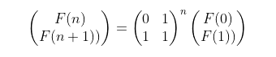
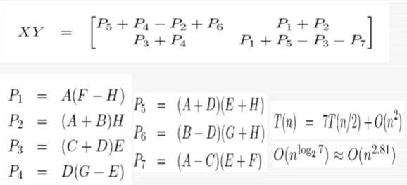

# Week2

## Computing the Fibonacci Series

We aim to check the Correctness of a few algorithms, how much time they will take, and whether we can do any better.

The standard recursive and iterative implementations to calculate the nth Fibonacci number are O(n2) algorithms, even with optimisation techniques like memoisation due to the simple fact that an upto O(n) multiplication must be done upto n-1 times to calculate the nth member of the Fibonacci series.

An alternate approach would be to treat the computation of the next member of the Fibonacci series as a transformation of the form 

The next steps would be to diagonalise the transformation to simplify multiplying it n times.

While addition of integers can be considered to be a constant time operation, the multiplication of large integers still adds O(n) to any algorithm's complexity. Thus we must try to minimise the number of multiplications we have to do.

Here comes the divide and conquer approach of Karatsuba’s Multiplication.

We split each integer into two halves, creating 4 numbers out of the face values digits of the original two integers, and through 3 multiplications, along with addition, subtraction and shifts, we are able to achieve the original result. If we are to carry out this division process recursively, we can fundamentally reduce the complexity from O(n2) to O (nlog23).

Anoter example of this Divide adn Conquer approach can be seen in the Merge Sort Algorithm, where we recursively split the list into 2 halves and sort the halves before merging them back together. Any sorting algorithm involving n numbers has n! permutations. A sorting algorithm would have to make at least log2(n!) omparisons in order to sort the list of numbers. If the comparison time is constant, this means any sorting algortihm can be mapped to a binary number of length log2(n!). Thus &Omega;(nlogn) is the lower bound on comparison based sorting as it can be broken down to n comparisons at log(n) levels of the decision tree.

Anotehr example of Divide and Conquer is Strassen's algorithm for multiplying matrices. We split the an n x n matrix into 4 smaller matrices of size n/2 x n/2 size. Under the naive aproach to calculating matrix prodeucts, we would then need eight multiplications to reach the answer, giving an O(n3) runtime. Strassen's Algorithm reduces this to 7 multiplcaitions per step.

